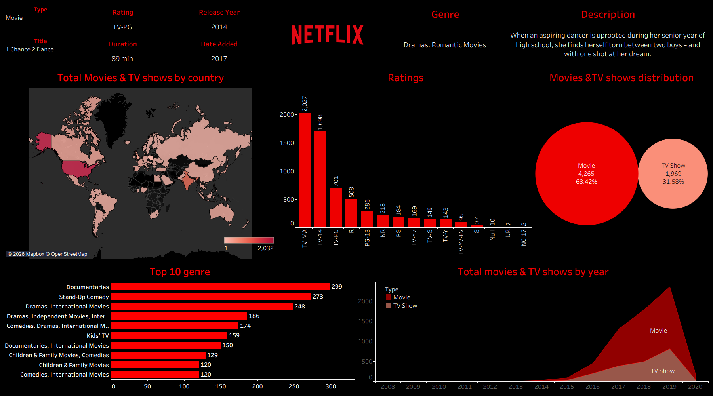

# Netflix Tableau Dashboard

An interactive Tableau dashboard for exploring Netflix Movies and TV
Shows using content type, ratings, release year, country, genre, and
content trends.

## Dashboard Preview



## Project Overview

This project presents a Tableau dashboard built to analyze the Netflix
content catalog and provide a quick view of:

-   Movies vs TV Shows distribution
-   Content ratings
-   Content availability by country
-   Top 10 genres
-   Movies and TV Shows added/released by year
-   Individual title-level details such as type, rating, release year,
    duration, date added, genre, and description

The dashboard uses an interactive dark-themed design with
Netflix-inspired styling.

## Dashboard Structure

### 1. Title Details / KPI Section

The top section displays details for a selected title:

-   Type
-   Title
-   Rating
-   Duration
-   Release Year
-   Date Added
-   Genre
-   Description

### 2. Total Movies & TV Shows by Country

A world map shows the geographic distribution of Netflix content by
country.

**Purpose:** Identify countries with a larger number of Movies and TV
Shows in the dataset.

### 3. Ratings Distribution

A vertical bar chart displays the number of titles for each content
rating.

**Examples:** TV-MA, TV-14, TV-PG, PG-13, NR, PG, TV-Y7, TV-G, TV-Y,
etc.

### 4. Movies & TV Shows Distribution

A bubble-style chart compares the overall number and percentage of:

-   Movies
-   TV Shows

### 5. Top 10 Genres

A horizontal bar chart displays the most common genres in the dataset.

Examples include:

-   Documentaries
-   Stand-Up Comedy
-   Dramas, International Movies
-   Comedies
-   Kids' TV
-   Children & Family Movies

### 6. Total Movies & TV Shows by Year

An area chart shows how the number of Movies and TV Shows changes over
the years.

This helps identify content growth and yearly trends.

## Suggested Repository Structure

``` text
Netflix-Tableau-Dashboard/
│
├── README.md
│
├── Tableau/
│   └── Netflix_Dashboard.twbx
│
├── Dataset/
│   └── netflix_titles.csv
│
├── Screenshots/
│   └── Netflix_dashboard.png
│
└── Assets/
    └── Netflix logo.png
```

> If your Tableau workbook is `.twb` instead of `.twbx`, replace the
> workbook filename accordingly.

## Dataset

The dashboard is based on a Netflix titles dataset containing
information such as:

-   show_id
-   type
-   title
-   director
-   cast
-   country
-   date_added
-   release_year
-   rating
-   duration
-   listed_in
-   description

## Key Visualizations

  Visualization                Purpose
  ---------------------------- --------------------------------------
  World Map                    Analyze content by country
  Rating Bar Chart             Compare content ratings
  Movie/TV Show Bubble Chart   Compare content types
  Top 10 Genre Bar Chart       Identify popular genres
  Yearly Area Chart            Analyze content trends over time
  Title Details                Explore individual title information

## Tableau Features Used

-   Calculated Fields
-   Filters
-   Parameters / Interactive Selection
-   Bar Charts
-   Area Charts
-   Bubble Charts
-   Maps
-   Tooltips
-   Dashboard Actions
-   Formatting and Custom Layout
-   Data Labels
-   Geographic Analysis

## Skills Demonstrated

-   Tableau
-   Data Visualization
-   Data Analysis
-   Dashboard Development
-   Interactive Filters
-   Business Intelligence
-   Data Cleaning
-   Exploratory Data Analysis

## How to Use

1.  Download or clone this repository.
2.  Open the Tableau workbook from the `Tableau` folder.
3.  If Tableau asks for the data source, connect it to the CSV file in
    the `Dataset` folder.
4.  Open the dashboard.
5.  Use the available filters and selections to explore the data.

## Business Questions Answered

-   How is Netflix content distributed across countries?
-   What are the most common content ratings?
-   What is the proportion of Movies and TV Shows?
-   Which genres have the highest number of titles?
-   How has Netflix content changed over the years?
-   What details are available for an individual title?

## Project Highlights

-   Interactive Tableau dashboard
-   Geographic content analysis
-   Movie vs TV Show comparison
-   Genre and rating analysis
-   Year-over-year content trend analysis
-   Title-level information through interactive selection
-   Clean dark-themed dashboard design

## Author

**Manas Ranjan Meher**

-   GitHub: https://github.com/manasranjanmeher99
-   LinkedIn: https://www.linkedin.com/in/manas-ranjan-meher-606181280/

## Note

This project is created for data analysis and visualization practice
using Tableau. Netflix and its related trademarks belong to their
respective owners.
